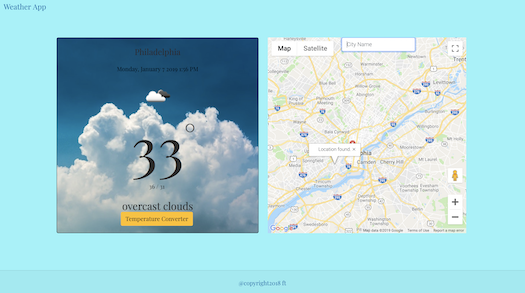

<h2>Weather App</h2>
 

 

This is a simple wearther app that use google api and open weather app api to search for a weather by city.

To test, clone the repo / download as a zip file and insert your api for both google and openappweather-api.

<h3>Technologies used</h3>
<ul>
<li>HTML5</li>
<li>Css3</li>
<li>Bootstrap 4</li>
<li>Javascript</li>
<li>JQuery</li>
</ul>

